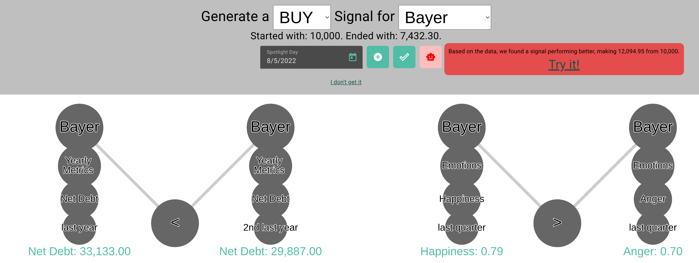

# Strategy Assessment

An application designed to support trading decisions for investors (link: https://strategy-assessment.com )

## The Vision

Every investor - how tiny their amount of money may be - has some sort of idea they want to implement using their investment strategy.
Thus, it would be a game changer if every user could automate not only implementing, but also testing their own strategy, relying on whatever features they can think of.
It would be even better if they can make use of (admittedly hyped) AI, as supposedly the big players in the stock market already do.
This repo proposes a prototype that covers automation of every investment strategy a user can think of, with features they can think of, and with features they had
not previously considered.

### Why no one came up with this idea yet

- User requests that trigger LLM’s are expensive.
- There is no holy grail in investing and many people believe it’s more luck than anything. It seems unprofessional to try to "lure" them into using certain investment strategies.
- Words like "implementing" and "features" sound too technical for every day users to get in touch with. How could developing an investment strategy be fun?

### Why this idea is good

- A user request doesn’t trigger a single neural network. All features are pre-calculated and sent to evolutionary algorithms.
- Yes, users get feedback on how they can improve their trading strategies. However, this functionality should be framed as assess your trading strategy over we provide you with the holy grail.
- A standardized, easy-to-understand strategy structure takes the complexity out of the user’s sight. It could even be replaced by a natural language interface (at the expense of transparency).

### Provider's benefits

- Investing via "strategy triggers" is cheap, as orders can be aggregated over the same strategies from different users.
- The common "strategy language" can be used to discuss or share trading strategies. The possibilities from a marketing perspective are huge.
- Hand users the resources that have been previously accessible only to big players.

## The Prototype

### In a nutshell
- Users can combine comparisons between various features to re-build trading ideas they already follow.
- Users can backtest their strategy on its performance on past data.
- Users are provided with improvement ideas from the AI backend.

### Check it out!
You can try out the prototype at: https://strategy-assessment.com

To get started, work your way through the demo that opens at "I don't get it".

## Built With

- [Angular](https://angular.io/) - The web framework used
- [Flask](http://flask.palletsprojects.com/) - The backend framework
- [DEAP](https://github.com/DEAP/deap) - The Evolutionary Programming framework

## Authors

- **Raphael Baier**

----- see our project https://donezone.de/
